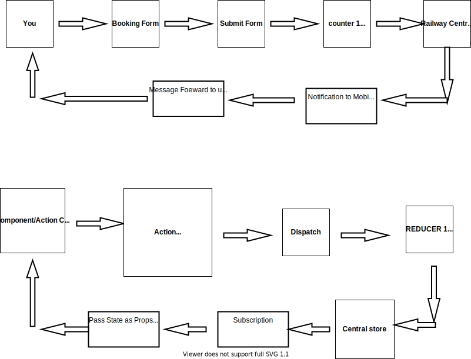

# reactredux-app
Creating new react redux based app for learning purpose 
  ========================================================= 
  <h1><b>----Redux---</b></h1>
  ---------------------------------------------------------
  <ul>
  <li>State Management Library</li>
  <li>It provides centralized store <i>(Component direct access data)</i></li>
  <li>Easily Debuggable using Redux DevTools</li>
  <li></li>
  </ul>
  ----------------------------------------------------------
  Redux Life Cycle WIth Example 

  
  